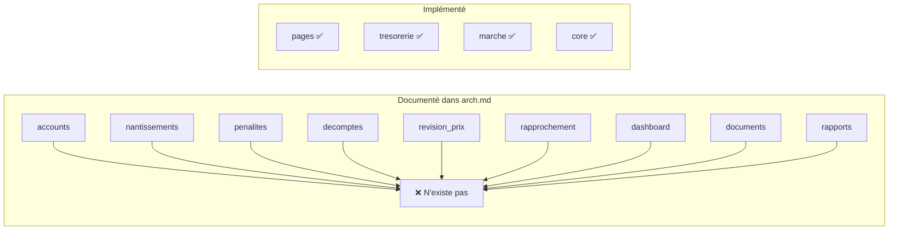

# 🔍 Rapport d'Audit — MP_Manager

**Projet :** ERP de Gestion des Marchés Publics Marocains
**Framework :** Django 6.0.7 · Python · SQLite
**Date d'audit :** 21 septembre 2026

---

## 📊 Résumé Exécutif

| Catégorie | Sévérité | Nombre de problèmes |
|:---|:---:|:---:|
| 🔴 Sécurité critique | **CRITIQUE** | 5 |
| 🟠 Architecture & Configuration | **ÉLEVÉE** | 8 |
| 🟡 Qualité du Code | **MOYENNE** | 10 |
| 🔵 Bonnes Pratiques | **BASSE** | 7 |
| **Total** | | **30** |

> [!CAUTION]
> Ce projet présente **5 vulnérabilités de sécurité critiques** qui doivent être corrigées avant toute mise en production. En l'état, le projet est **uniquement adapté au développement local**.

---

## 1. 🔴 Sécurité — Problèmes Critiques

### 1.1 SECRET_KEY exposée en dur (CWE-798)

**Fichier :** [settings.py](file:///home/otmane/Bureau/MP/MP_Manager/MP_Manager/settings.py#L24)

```python
SECRET_KEY = "django-insecure-_klksqsmvrwemwof4@4(f$nz-oitd#l=&14u0t4&cxm^3$ehtt"
```

**Impact :** Un attaquant peut :
- Forger des cookies de session
- Contourner les protections CSRF
- Signer des données arbitraires
- Manipuler les tokens de réinitialisation de mot de passe

**Correction :**
```python
import os
SECRET_KEY = os.environ.get("DJANGO_SECRET_KEY")
```

---

### 1.2 DEBUG = True committé dans le code source

**Fichier :** [settings.py](file:///home/otmane/Bureau/MP/MP_Manager/MP_Manager/settings.py#L27)

**Impact :** Expose les stack traces complètes, le code source, les variables locales, et le schéma de la base de données à tout utilisateur en cas d'erreur.

---

### 1.3 ALLOWED_HOSTS vide

**Fichier :** [settings.py](file:///home/otmane/Bureau/MP/MP_Manager/MP_Manager/settings.py#L29)

```python
ALLOWED_HOSTS = []
```

**Impact :** Passer `DEBUG = False` sans configurer `ALLOWED_HOSTS` rend le site immédiatement inaccessible (erreur 400).

---

### 1.4 Contournement d'authentification via le middleware

**Fichier :** [middleware.py](file:///home/otmane/Bureau/MP/MP_Manager/core/middleware.py#L60-L76)

```python
public_prefixes = ["/login", "/password_reset", "/reset", "/static", "/media"]

if any(request.path.startswith(prefix) for prefix in public_prefixes):
    return self.get_response(request)
```

**Problèmes :**
- `startswith("/login")` autorise **toute URL** commençant par `/login` (ex: `/login_bypass/`, `/loginstats/`)
- `request.path` injecté directement dans le query string `?next=` → risque d'**open redirect** et **injection CRLF**
- URL de redirection hardcodée au lieu d'utiliser `settings.LOGIN_URL` ou `reverse('login')`

**Correction recommandée :**
```python
from django.conf import settings
from django.urls import reverse

public_paths = {reverse("login"), "/password_reset/", "/reset/"}
public_prefixes = ["/static/", "/media/"]  # avec trailing slash

if request.path in public_paths or any(request.path.startswith(p) for p in public_prefixes):
    return self.get_response(request)

from django.utils.http import url_has_allowed_host_and_scheme
next_url = request.path if url_has_allowed_host_and_scheme(request.path, allowed_hosts={request.get_host()}) else "/"
return redirect(f"{settings.LOGIN_URL}?next={next_url}")
```

---

### 1.5 Absence de protections HTTPS & Cookies

**Fichier :** [settings.py](file:///home/otmane/Bureau/MP/MP_Manager/MP_Manager/settings.py)

| Paramètre manquant | Risque |
|:---|:---|
| `SESSION_COOKIE_SECURE = True` | Cookie de session transmissible en HTTP clair |
| `CSRF_COOKIE_SECURE = True` | Token CSRF interceptable |
| `SECURE_SSL_REDIRECT = True` | Pas de redirection vers HTTPS |
| `SECURE_HSTS_SECONDS` | Pas de HSTS |
| `CSRF_TRUSTED_ORIGINS` | Requis derrière un reverse proxy HTTPS |

---

## 2. 🟠 Architecture & Configuration

### 2.1 Écart majeur entre arch.md et l'implémentation réelle

**Fichier :** [arch.md](file:///home/otmane/Bureau/MP/MP_Manager/arch.md)

Le document d'architecture décrit **10 applications** et une structure `apps/` + `config/`. La réalité du projet :



| Élément | Documenté | Implémenté |
|:---|:---:|:---:|
| `apps/` directory | ✅ | ❌ (apps à la racine) |
| `config/` directory | ✅ | ❌ (`MP_Manager/`) |
| `requirements/` | ✅ | ❌ |
| `media/` | ✅ | ❌ |
| `docs/` | ✅ | ❌ |
| App `pages` | ❌ | ✅ |
| 9 apps métier (accounts, nantissements, etc.) | ✅ | ❌ |

> [!IMPORTANT]
> Le document d'architecture ne reflète pas l'état actuel du code. Il doit être mis à jour ou le code doit être restructuré pour s'y conformer.

---

### 2.2 `core` absent de INSTALLED_APPS

**Fichier :** [settings.py](file:///home/otmane/Bureau/MP/MP_Manager/MP_Manager/settings.py#L34-L46)

L'app `core` fournit le middleware `LoginRequiredMiddleware` et les classes abstraites (`HorodatageMixin`, `DocumentLieAuMarche`), mais elle **n'est pas déclarée** dans `INSTALLED_APPS`. Conséquences :
- Aucune migration, aucun modèle, aucune commande management de `core` ne sera découvert
- Si `core` a des signals ou un `AppConfig`, ils sont ignorés

---

### 2.3 Modèle dupliqué `Marche`

Il existe **deux modèles "Marché"** dans le projet :

| Modèle | Fichier | Champs |
|:---|:---|:---|
| `pages.Marche` | [pages/models.py](file:///home/otmane/Bureau/MP/MP_Manager/pages/models.py#L5-L12) | `nom`, `description`, `date_creation`, `date_modification` |
| `marche.FicheMarche` | [marche/models.py](file:///home/otmane/Bureau/MP/MP_Manager/marche/models.py#L54-L249) | 20+ champs métier (financiers, juridiques, etc.) |

> [!WARNING]
> La vue [marche/views.py](file:///home/otmane/Bureau/MP/MP_Manager/marche/views.py#L8) utilise `FicheMarche.objects.all()` mais le template [tableau_marche.html](file:///home/otmane/Bureau/MP/MP_Manager/templates/marche/tableau_marche.html#L20-L23) affiche `marche.nom`, `marche.description`, `marche.date_creation` — des champs de `pages.Marche`, **pas de `FicheMarche`**. Cela produira des valeurs vides ou des erreurs.

---

### 2.4 Conflit STATIC_ROOT / STATICFILES_DIRS

**Fichier :** [settings.py](file:///home/otmane/Bureau/MP/MP_Manager/MP_Manager/settings.py#L128-L130)

```python
STATIC_ROOT = os.path.join(BASE_DIR, "static")       # ← le dossier static/ du projet
STATICFILES_DIRS = [os.path.join(BASE_DIR, "MP_Manager/static")]
```

- `STATIC_ROOT` pointe vers le répertoire `static/` qui **contient déjà des fichiers** (CSS, images)
- `collectstatic` risque d'écraser ou de provoquer des conflits
- `STATIC_URL = "static/"` manque le slash initial (`"/static/"`)

---

### 2.5 Pas de `requirements.txt`

Aucun fichier de dépendances n'existe. Les dépendances détectées :
- `Django >= 6.0.7`
- `django-bootstrap5`
- `pandas` (pour `import_data.py`)
- `openpyxl` (dépendance implicite de pandas pour `.xlsx`)

---

### 2.6 Pas de `.gitignore` à la racine

Les fichiers suivants sont probablement commités dans git :
- `db.sqlite3` (200 Ko) — **contient des données sensibles**
- `*.csv` (données brutes)
- `__pycache__/`

---

### 2.7 SQLite pour un ERP

SQLite est inadapté pour un ERP de marchés publics :
- Pas de support d'écriture concurrente
- Pas de sauvegarde en continu
- Pas de contrôle d'accès au niveau BDD
- Migration vers PostgreSQL recommandée pour la production

---

### 2.8 `TIME_ZONE = "UTC"` au lieu de `Africa/Casablanca`

Pour un ERP marocain, le fuseau horaire devrait être `Africa/Casablanca` (UTC+1).

---

## 3. 🟡 Qualité du Code

### 3.1 `fields = "__all__"` dans les vues CRUD

**Fichier :** [tresorerie/views.py](file:///home/otmane/Bureau/MP/MP_Manager/tresorerie/views.py#L15-L26)

```python
class TresorerieCreateView(CreateView):
    fields = "__all__"

class TresorerieUpdateView(UpdateView):
    fields = "__all__"
```

**Impact :** Expose **tous les champs** du modèle dans le formulaire, y compris `created_at` et `updated_at`. Un utilisateur malveillant pourrait manipuler des champs sensibles via le POST.

**Correction :** Utiliser un `ModelForm` explicite avec les champs autorisés.

---

### 3.2 Propriété `montant_ttc` vide

**Fichier :** [marche/models.py](file:///home/otmane/Bureau/MP/MP_Manager/marche/models.py#L251-L261)

```python
@property
def montant_ttc(self):
    """... docstring ..."""
    # ← pas de return ! Retourne None implicitement
```

La propriété a une docstring mais **aucun corps de calcul**. Elle retourne toujours `None`.

---

### 3.3 ForeignKey vers `"FicheMarche"` dans `core/coreFcn.py`

**Fichier :** [core/coreFcn.py](file:///home/otmane/Bureau/MP/MP_Manager/core/coreFcn.py#L26-L31)

```python
marche = models.ForeignKey(
    "FicheMarche",  # ← référence sans préfixe d'app
    on_delete=models.PROTECT,
)
```

La référence devrait être `"marche.FicheMarche"` (avec le label d'app) pour être correcte. Sans `core` dans `INSTALLED_APPS`, ce comportement est encore plus imprévisible.

---

### 3.4 Script `import_data.py` non fonctionnel

**Fichier :** [import_data.py](file:///home/otmane/Bureau/MP/MP_Manager/import_data.py)

| Problème | Ligne | Description |
|:---|:---:|:---|
| Module introuvable | 8 | `DJANGO_SETTINGS_MODULE = "mon_projet.settings"` → `ModuleNotFoundError` |
| Import fictif | 13 | `from votre_app.models import MonModele` → crash |
| Fichier manquant | 84 | `donnees.xlsx` n'existe pas |
| Pas de `batch_size` | 78 | `bulk_create` sans `batch_size` → crash SQLite sur +50 lignes |
| Pas de transaction | — | Aucun `transaction.atomic()` → état inconsistant possible |
| Erreurs silencieuses | 27 | `except Exception: return None` → montants invalides perdus silencieusement |
| Code mort | 88-144 | Ancien prototype commenté (50% du fichier) |

---

### 3.5 Code mort et commenté massivement

| Fichier | Lignes commentées | % du fichier |
|:---|:---:|:---:|
| [middleware.py](file:///home/otmane/Bureau/MP/MP_Manager/core/middleware.py) | L1-57 | **77%** |
| [import_data.py](file:///home/otmane/Bureau/MP/MP_Manager/import_data.py) | L88-144 | **40%** |
| [pages/views.py](file:///home/otmane/Bureau/MP/MP_Manager/pages/views.py) | L2-12 | **30%** |
| [navbar.html](file:///home/otmane/Bureau/MP/MP_Manager/templates/parts/navbar.html) | L66-122 | **47%** |
| [tresorerie/views.py](file:///home/otmane/Bureau/MP/MP_Manager/tresorerie/views.py) | L35-47 | **27%** |

---

### 3.6 Pas de tests

Les fichiers `tests.py` dans `marche/`, `tresorerie/`, et `pages/` sont **vides** — aucun test unitaire n'existe.

---

### 3.7 `@login_required` commenté

**Fichier :** [pages/views.py](file:///home/otmane/Bureau/MP/MP_Manager/pages/views.py#L14-L31)

```python
# @login_required    ← commenté
def index(request):
    ...

# @login_required    ← commenté
def tresorerie(request):
    ...
```

Le middleware global compense ce manque, mais la double protection (décorateur + middleware) est une bonne pratique de défense en profondeur.

---

### 3.8 Template `base.html` invalide

**Fichier :** [base.html](file:///home/otmane/Bureau/MP/MP_Manager/templates/base.html)

```html

<link rel="stylesheet" href="">



<div class="container-fluid">
    
</div>

```

**Problèmes :**
- ❌ Pas de `<!DOCTYPE html>`, `<html>`, `<head>`, `<body>`
- ❌ Pas de `<meta charset>` ni `<meta viewport>`
- ❌ Pas de `<title>` (les `` des enfants ne sont pas rendus)
- ❌ Pas de `` ni `` → les blocs dans `tresorerie_table.html` ne sont **jamais rendus**
- Conséquence : DataTables ne se charge **jamais** sur la page trésorerie

---

### 3.9 CDN externe sans SRI (Subresource Integrity)

**Fichier :** [tresorerie_table.html](file:///home/otmane/Bureau/MP/MP_Manager/templates/tr_tableau/tresorerie_table.html#L7-L87)

```html
<script src="https://code.jquery.com/jquery-3.7.0.min.js"></script>
<script src="https://cdn.datatables.net/1.13.6/js/jquery.dataTables.min.js"></script>
```

Aucun attribut `integrity` → un CDN compromis pourrait injecter du code malveillant.

---

### 3.10 Suppression via lien GET au lieu de POST

**Fichier :** [tresorerie_table.html](file:///home/otmane/Bureau/MP/MP_Manager/templates/tr_tableau/tresorerie_table.html#L74)

```html
<a href="" class="btn btn-sm btn-danger">Supprimer</a>
```

Le lien de suppression utilise un GET, ce qui permet à un crawler, un prefetch navigateur, ou un attaquant via CSRF de supprimer des données.

---

## 4. 🔵 Bonnes Pratiques Manquantes

| # | Problème | Recommandation |
|:---:|:---|:---|
| 1 | Pas de `.env` / `django-environ` | Externaliser tous les secrets et config |
| 2 | Pas de `LOGGING` configuré | Configurer les logs applicatifs et sécurité |
| 3 | Pas de `MEDIA_URL` / `MEDIA_ROOT` | Nécessaire si upload de fichiers prévu |
| 4 | Incohérence `os.path.join` / `Path` | Standardiser vers `Path` partout |
| 5 | Pas de pagination sur les vues | `FicheMarche.objects.all()` charge tout en mémoire |
| 6 | Préfixe URL majuscule `TR/` | Convention REST : tout en minuscule `tr/` |
| 7 | Dropdown navbar placeholder | "Action", "Another action" → contenu non implémenté |

---

## 5. ✅ Points Positifs

Malgré les problèmes, le projet a des fondations solides :

| ✅ | Détail |
|:---|:---|
| **Modèles bien structurés** | `FicheMarche`, `Nantissement`, `Penalite` avec relations FK, validators, choices, index |
| **Classes abstraites** | `HorodatageMixin` et `DocumentLieAuMarche` dans `core` — bonne factorisation |
| **QuerySet personnalisé** | `FicheMarcheQuerySet.avec_statut_nantissement()` avec `Exists` — performant |
| **Calcul TTC propre** | Utilisation correcte de `Decimal` avec `ROUND_HALF_UP` |
| **Admin Django configuré** | `list_display`, `search_fields`, `list_filter` pour chaque modèle |
| **CSRF token dans les formulaires** | `` présent dans login et logout |
| **Logout en POST** | Le navbar utilise un `<form method="post">` pour la déconnexion |
| **Bootstrap 5 via django-bootstrap5** | UI cohérente et responsive |
| **Middleware d'authentification global** | Protection par défaut de toutes les routes |
| **Validators RIB** | Validation regex pour le format RIB marocain (24 chiffres) |

---

## 6. 🎯 Plan d'Action Prioritaire

### Phase 1 — Sécurité Immédiate (avant toute mise en production)

```
1. [x] Générer une nouvelle SECRET_KEY et la déplacer dans .env
2. [x] Paramétrer DEBUG, ALLOWED_HOSTS, DATABASES via variables d'env
3. [x] Créer un .gitignore (db.sqlite3, .env, __pycache__, *.pyc, media/)
4. [x] Corriger le middleware (exact match + validation de next_url)
5. [x] Ajouter les paramètres de sécurité cookies/HTTPS
```

### Phase 2 — Configuration (semaine 1)

```
6. [ ] Ajouter 'core' dans INSTALLED_APPS
7. [ ] Corriger STATIC_ROOT vs STATICFILES_DIRS
8. [ ] Créer requirements.txt (pip freeze)
9. [ ] Fixer TIME_ZONE = "Africa/Casablanca"
10.[ ] Corriger la FK "FicheMarche" → "marche.FicheMarche" dans core
11.[ ] Supprimer le modèle pages.Marche (doublon)
```

### Phase 3 — Qualité (semaine 2)

```
12.[ ] Corriger base.html (DOCTYPE, head, body, blocks extra_css/extra_js)
13.[ ] Implémenter la propriété montant_ttc (corps manquant)
14.[ ] Remplacer fields="__all__" par un ModelForm explicite
15.[ ] Ajouter SRI sur les CDN externes
16.[ ] Supprimer tout le code commenté/mort
17.[ ] Écrire les premiers tests unitaires
```

### Phase 4 — Évolution (semaines 3+)

```
18.[ ] Migrer vers PostgreSQL
19.[ ] Implémenter les apps manquantes (nantissements, pénalités, dashboard...)
20.[ ] Mettre à jour arch.md pour refléter la réalité
21.[ ] Refactorer import_data.py en management command Django
22.[ ] Ajouter la pagination aux vues de liste
```

---

> [!NOTE]
> Cet audit a été réalisé par analyse statique du code source uniquement. Un audit complet nécessiterait également : tests de pénétration, analyse des dépendances (CVE), revue de la base de données existante, et tests de charge.
